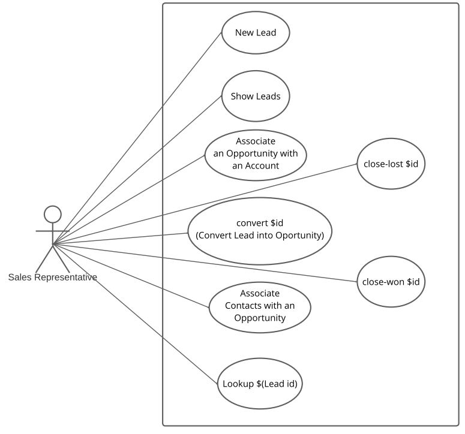
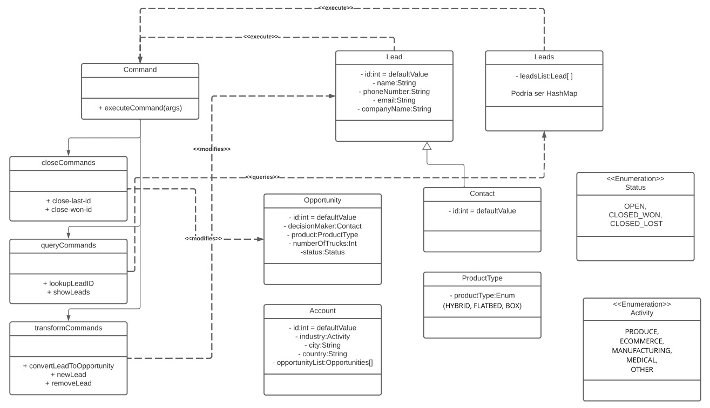

# CRM - OOP Homework (Unit 2)

Delivered exercise. CRM - DataLayer Homework (Unit 3) (IRONHACK)

Welcome to the ultimate CRM (Customer Relationship Management) system. CRMs are a tool that almost every sales team uses to track prospective and existing customers through the sales process.

This CRM allows us to:

- Track Leads
- Convert Leads into Opportunities
- Associate Sales Representarives with Leads or Opportunities
- Associate an Opportunity with an Account.
- Associate a Contact with an Opportunity.
- Generate a wide variety of reports. (In fact . . . maybe not that wide of a variety)

Leads, Sales Representatives, Contacts, Opportunities and Accounts are stored in a MySQLremote database so you never loose information from your beloved customers.

## Diagrams

Case Diagram

Class Diagram

## How to try it

You just need to run the program and choose the option you need.
You can interact with commands like:

<table border="0">
 <tr style="border: none!important;">
    <td style="border: none!important;">
showleads:  
showopportunities:  
showcontacts:  
showaccounts:  
showsalesreps:  
lookuplead:  
newlead:  
newsalesrep:  
removelead:  
convert:  
close-lost:  
close-won:  
exit:  
</td>
    <td style="border: none!important;">
list of leads 
list of opportunities 
list of contacts 
list of accounts 
list of opportunities 
specific lead by id 
create a new lead 
create a new sales representative 
removes a lead 
converts leads to opportunities 
opportunity status lost  
opportunity status won  
exits the program 
</td>
 </tr>
</table>

## Requirements

We are providing our own database. Just clone the code, open it with IntelliJ and you are good to go.

Remember that in order to try the tests you need to comment the 'run()' method in the class CrmDataLayerApplication.java 

## Usage

You just need to type the command you need, press ENTER and follow the given instructions.

Here is an example:

## Contributing

Pull requests are welcome

## License

[MIT](LICENSE.txt)
